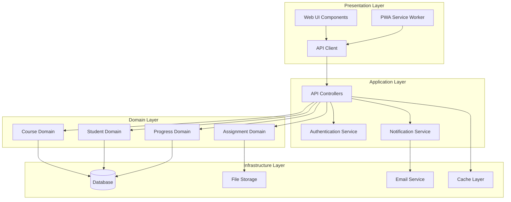
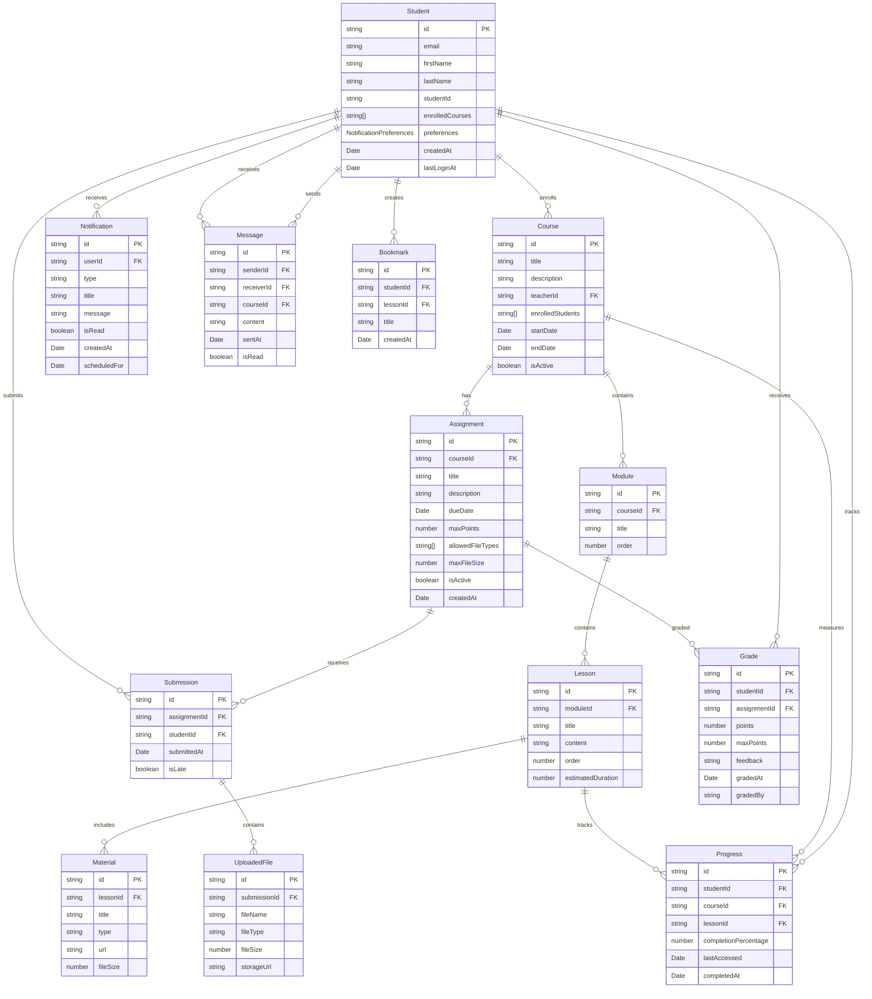

# Design Document: Student Learning Management System

## Overview

The Student Learning Management System is designed as a web-first application that provides an intuitive, responsive platform for school students to access courses, submit assignments, track progress, and communicate with teachers. The system prioritizes accessibility, performance, and user experience across all devices while maintaining robust security and scalability.

## Architecture

### Web-First Design Approach

The system follows a web-first design philosophy, ensuring:
- **Progressive Web App (PWA)** capabilities for mobile-like experience
- **Responsive design** that adapts seamlessly from desktop to mobile
- **Offline-first** functionality for core features like reading materials
- **Fast loading** with optimized assets and lazy loading
- **Cross-platform compatibility** without native app development overhead

### Architecture Pattern: Layered Architecture with Clean Architecture Principles



### Technology Stack

**Frontend:**
- **Framework**: React 18+ with TypeScript for component-based UI
- **Styling**: Tailwind CSS for responsive, utility-first design
- **PWA**: Service Workers for offline capabilities and caching
- **State Management**: React Context API with useReducer for state management
- **Build Tool**: Vite for fast development and optimized builds
- **Testing**: Jest + React Testing Library for unit tests, fast-check for property-based testing

**Backend:**
- **Runtime**: Node.js 18+ with Express.js framework
- **Language**: TypeScript for type safety and better developer experience
- **Database**: PostgreSQL 15+ for relational data with Redis for caching and sessions
- **ORM**: Prisma for database operations and migrations
- **File Storage**: Local storage for development, AWS S3 for production
- **Authentication**: JWT tokens with refresh token rotation using jsonwebtoken

**Infrastructure:**
- **Containerization**: Docker with multi-stage builds for both frontend and backend
- **Database**: PostgreSQL container with persistent volumes
- **Reverse Proxy**: Nginx for serving static files and API routing
- **Development**: Docker Compose for local development environment
- **Deployment**: Container orchestration ready (Kubernetes/Docker Swarm)

**Development Tools:**
- **API Documentation**: OpenAPI/Swagger for API specification
- **Code Quality**: ESLint, Prettier for code formatting
- **Git Hooks**: Husky for pre-commit hooks and code quality checks
- **Monitoring**: Winston for logging, basic health check endpoints

## UI Mockups and Wireframes

### Student Dashboard Mockup

```mermaid
graph TB
    subgraph "Student Dashboard Layout"
        Header[Header: Logo | Student Name | Notifications | Logout]
        
        subgraph "Main Content Area"
            subgraph "Left Sidebar"
                Nav[Navigation Menu<br/>- Dashboard<br/>- My Courses<br/>- Assignments<br/>- Grades<br/>- Messages<br/>- Settings]
            end
            
            subgraph "Dashboard Content"
                Welcome[Welcome Message: Hello, John!]
                
                subgraph "Course Grid"
                    Course1[Course Card 1<br/>Mathematics 101<br/>Progress: 75%<br/>Next: Assignment Due]
                    Course2[Course Card 2<br/>English Literature<br/>Progress: 60%<br/>Next: Quiz Tomorrow]
                    Course3[Course Card 3<br/>History<br/>Progress: 90%<br/>Next: Reading Chapter 5]
                end
                
                subgraph "Quick Actions"
                    UpcomingAssignments[Upcoming Assignments<br/>- Math Homework (Due: Tomorrow)<br/>- Essay Draft (Due: Friday)<br/>- Science Lab Report (Due: Monday)]
                    RecentGrades[Recent Grades<br/>- Math Quiz: A- (92%)<br/>- English Essay: B+ (87%)<br/>- History Test: A (95%)]
                end
            end
        end
    end
```

### Course Viewer Mockup

```mermaid
graph TB
    subgraph "Course Viewer Layout"
        CourseHeader[Course Header: Mathematics 101 | Progress: 75% | Bookmark]
        
        subgraph "Course Navigation"
            Breadcrumb[Home > My Courses > Mathematics 101 > Module 2 > Lesson 3]
            
            subgraph "Left Panel - Course Structure"
                Module1[📁 Module 1: Algebra Basics<br/>✅ Lesson 1: Introduction<br/>✅ Lesson 2: Linear Equations<br/>✅ Lesson 3: Practice Problems]
                Module2[📁 Module 2: Quadratic Equations<br/>✅ Lesson 1: Theory<br/>🔄 Lesson 2: Examples<br/>⏸️ Lesson 3: Advanced Problems]
                Module3[📁 Module 3: Functions<br/>🔒 Lesson 1: Basic Functions<br/>🔒 Lesson 2: Graphing]
            end
            
            subgraph "Main Content Area"
                LessonTitle[Lesson 2: Quadratic Equation Examples]
                VideoPlayer[📹 Video Player<br/>Duration: 15:30<br/>Progress: 8:45]
                LessonContent[Lesson Content<br/>Text, images, interactive elements<br/>Download PDF | Bookmark Section]
                Navigation[⬅️ Previous Lesson | Next Lesson ➡️]
            end
            
            subgraph "Right Panel - Resources"
                Materials[📎 Materials<br/>- Lecture Notes.pdf<br/>- Practice Sheet.pdf<br/>- Calculator Tool]
                Discussion[💬 Discussion<br/>3 new messages<br/>Ask a Question]
            end
        end
    end
```

### Assignment Manager Mockup

```mermaid
graph TB
    subgraph "Assignment Manager Layout"
        AssignmentHeader[Assignment: Quadratic Equations Problem Set]
        
        subgraph "Assignment Details"
            Info[📋 Assignment Information<br/>Due: March 15, 2024 at 11:59 PM<br/>Points: 100<br/>Attempts: 1 of 3<br/>Status: Not Submitted]
            
            Instructions[📝 Instructions<br/>Solve the following quadratic equations...<br/>Show all work and explain your reasoning.<br/>Submit as PDF or image files.]
            
            Requirements[📋 Requirements<br/>- File types: PDF, JPG, PNG<br/>- Max file size: 10MB<br/>- Max files: 5]
        end
        
        subgraph "Submission Area"
            FileUpload[📤 File Upload Area<br/>Drag and drop files here<br/>or click to browse<br/><br/>📄 math_homework.pdf (2.3MB)<br/>❌ Remove]
            
            SubmissionHistory[📚 Previous Submissions<br/>No previous submissions]
            
            Actions[🔘 Save Draft | 🚀 Submit Assignment]
        end
        
        subgraph "Sidebar"
            Timer[⏰ Time Remaining<br/>2 days, 14 hours<br/>Set Reminder]
            
            Help[❓ Need Help?<br/>- Message Teacher<br/>- Course Discussion<br/>- Tutoring Center]
            
            RelatedMaterials[📖 Related Materials<br/>- Lesson 2: Examples<br/>- Practice Problems<br/>- Formula Sheet]
        end
    end
```

### Communication Hub Mockup

```mermaid
graph TB
    subgraph "Communication Hub Layout"
        CommHeader[Messages & Discussions]
        
        subgraph "Left Panel - Conversations"
            MessageList[📨 Messages<br/><br/>👨‍🏫 Prof. Smith (Math)<br/>Assignment clarification<br/>2 hours ago<br/><br/>👩‍🏫 Ms. Johnson (English)<br/>Essay feedback<br/>Yesterday<br/><br/>👨‍🎓 Study Group<br/>Group project discussion<br/>3 days ago]
            
            Discussions[💬 Course Discussions<br/><br/>📚 Mathematics 101<br/>5 new posts<br/><br/>📖 English Literature<br/>2 new posts<br/><br/>🏛️ History<br/>No new posts]
        end
        
        subgraph "Main Chat Area"
            ChatHeader[💬 Prof. Smith - Mathematics 101]
            
            Messages[Message Thread<br/><br/>👨‍🏫 Prof. Smith - 2 hours ago<br/>"The assignment deadline has been extended..."<br/><br/>👨‍🎓 You - 1 hour ago<br/>"Thank you for the extension. I have a question about problem #5..."<br/><br/>👨‍🏫 Prof. Smith - 30 min ago<br/>"For problem #5, remember to factor first..."]
            
            MessageInput[💭 Type your message...<br/>📎 Attach File | 😊 Emoji | 🚀 Send]
        end
        
        subgraph "Right Panel - Info"
            Participants[👥 Participants<br/>Prof. Smith<br/>You]
            
            SharedFiles[📎 Shared Files<br/>assignment_clarification.pdf<br/>formula_sheet.png]
            
            QuickActions[⚡ Quick Actions<br/>📞 Request Meeting<br/>📋 Create Study Group<br/>🔔 Notification Settings]
        end
    end
```

### Progress Tracker Mockup

```mermaid
graph TB
    subgraph "Progress Tracker Layout"
        ProgressHeader[Academic Progress Dashboard]
        
        subgraph "Overview Cards"
            GPA[📊 Current GPA<br/>3.75<br/>Target: 3.8]
            CompletedCourses[✅ Completed<br/>12 Courses<br/>This Semester: 4]
            TotalCredits[🎓 Credits<br/>45 / 120<br/>37.5% Complete]
        end
        
        subgraph "Course Progress"
            CourseProgress[📈 Course Progress<br/><br/>Mathematics 101 ████████░░ 80%<br/>English Literature ██████░░░░ 60%<br/>History ████████████ 95%<br/>Chemistry ████░░░░░░ 40%]
        end
        
        subgraph "Grade Breakdown"
            GradeChart[📊 Grade Distribution<br/><br/>A: ████████ 40%<br/>B: ██████ 30%<br/>C: ████ 20%<br/>D: ██ 10%<br/>F: 0%]
            
            RecentGrades[📋 Recent Grades<br/><br/>Math Quiz - A- (92%) - Mar 10<br/>English Essay - B+ (87%) - Mar 8<br/>History Test - A (95%) - Mar 5<br/>Chemistry Lab - B (85%) - Mar 3]
        end
        
        subgraph "Analytics"
            StudyTime[⏱️ Study Time This Week<br/>25 hours<br/>Goal: 30 hours]
            
            Achievements[🏆 Achievements<br/>🥇 Perfect Attendance<br/>📚 Bookworm (50 lessons)<br/>⚡ Quick Learner<br/>🎯 Goal Achiever]
            
            Recommendations[💡 Recommendations<br/>- Focus more on Chemistry<br/>- Great progress in History!<br/>- Consider study group for Math]
        end
    end
```

### Mobile Responsive Design

```mermaid
graph TB
    subgraph "Mobile Layout (Portrait)"
        MobileHeader[📱 Header: Menu ☰ | Logo | 🔔]
        
        subgraph "Mobile Navigation"
            BottomNav[Bottom Navigation<br/>🏠 Home | 📚 Courses | 📝 Tasks | 💬 Messages | 👤 Profile]
        end
        
        subgraph "Mobile Dashboard"
            MobileWelcome[Welcome, John! 👋]
            
            MobileCourses[📚 My Courses<br/><br/>📊 Math 101 - 75% ▶️<br/>📖 English - 60% ▶️<br/>🏛️ History - 90% ▶️]
            
            MobileQuickActions[⚡ Quick Actions<br/>📝 3 assignments due<br/>📊 2 new grades<br/>💬 5 unread messages]
        end
        
        subgraph "Mobile Features"
            OfflineMode[📱 Offline Mode<br/>✅ Downloaded content available<br/>🔄 Sync when online]
            
            PushNotifications[🔔 Push Notifications<br/>Assignment reminders<br/>Grade updates<br/>Messages]
        end
    end
```

## Components and Interfaces

### Core Components

#### 1. Student Dashboard Component
- **Purpose**: Central hub displaying courses, assignments, and progress
- **Key Features**: 
  - Course grid with progress indicators
  - Upcoming assignment alerts
  - Recent grade updates
  - Quick access to frequently used materials

#### 2. Course Viewer Component
- **Purpose**: Display course content and navigation
- **Key Features**:
  - Hierarchical content organization (modules/lessons)
  - Progress tracking per lesson
  - Bookmark functionality
  - Search within course content

#### 3. Assignment Manager Component
- **Purpose**: Handle assignment submission and tracking
- **Key Features**:
  - File upload with drag-and-drop
  - Submission history and status
  - Due date reminders
  - Grade display when available

#### 4. Communication Hub Component
- **Purpose**: Messaging and discussion functionality
- **Key Features**:
  - Direct messaging with teachers
  - Course discussion forums
  - Real-time notifications
  - Message threading and search

#### 5. Progress Tracker Component
- **Purpose**: Visual representation of academic progress
- **Key Features**:
  - Grade overview with GPA calculation
  - Progress charts and analytics
  - Achievement badges
  - Performance trends over time

### API Interface Design

#### RESTful API Endpoints

```
Authentication:
POST /api/auth/login
POST /api/auth/refresh
POST /api/auth/logout

Courses:
GET /api/courses - List enrolled courses
GET /api/courses/{id} - Get course details
GET /api/courses/{id}/materials - Get course materials
GET /api/courses/{id}/progress - Get course progress

Assignments:
GET /api/assignments - List assignments
GET /api/assignments/{id} - Get assignment details
POST /api/assignments/{id}/submit - Submit assignment
GET /api/assignments/{id}/submissions - Get submission history

Grades:
GET /api/grades - Get all grades
GET /api/grades/gpa - Calculate current GPA
GET /api/courses/{id}/grades - Get course-specific grades

Messages:
GET /api/messages - List messages
POST /api/messages - Send message
GET /api/messages/{id} - Get message thread
POST /api/discussions/{id}/posts - Post to discussion

Notifications:
GET /api/notifications - Get notifications
PUT /api/notifications/{id}/read - Mark as read
PUT /api/notifications/preferences - Update preferences
```

## Data Models

### Entity Relationship Diagram



### Class Diagram

```mermaid
classDiagram
    class Student {
        +string id
        +string email
        +string firstName
        +string lastName
        +string studentId
        +string[] enrolledCourses
        +NotificationPreferences preferences
        +Date createdAt
        +Date lastLoginAt
        +enrollInCourse(courseId: string)
        +getEnrolledCourses()
        +updatePreferences(preferences: NotificationPreferences)
        +calculateGPA()
    }
    
    class Course {
        +string id
        +string title
        +string description
        +string teacherId
        +Module[] modules
        +string[] enrolledStudents
        +Date startDate
        +Date endDate
        +boolean isActive
        +addModule(module: Module)
        +getStudentProgress(studentId: string)
        +checkPrerequisites(studentId: string)
    }
    
    class Module {
        +string id
        +string title
        +Lesson[] lessons
        +number order
        +addLesson(lesson: Lesson)
        +getCompletionStatus(studentId: string)
    }
    
    class Lesson {
        +string id
        +string title
        +string content
        +Material[] materials
        +number order
        +number estimatedDuration
        +addMaterial(material: Material)
        +markAsCompleted(studentId: string)
    }
    
    class Assignment {
        +string id
        +string courseId
        +string title
        +string description
        +Date dueDate
        +number maxPoints
        +string[] allowedFileTypes
        +number maxFileSize
        +boolean isActive
        +Date createdAt
        +validateSubmission(submission: Submission)
        +isOverdue()
    }
    
    class Submission {
        +string id
        +string assignmentId
        +string studentId
        +UploadedFile[] files
        +Date submittedAt
        +boolean isLate
        +Grade grade
        +addFile(file: UploadedFile)
        +calculateLateness()
    }
    
    class Grade {
        +string id
        +string studentId
        +string assignmentId
        +number points
        +number maxPoints
        +string feedback
        +Date gradedAt
        +string gradedBy
        +calculatePercentage()
        +getLetterGrade()
    }
    
    class NotificationService {
        +sendNotification(notification: Notification)
        +scheduleReminder(assignmentId: string, dueDate: Date)
        +sendGradeNotification(gradeId: string)
        +processNotificationQueue()
    }
    
    class ProgressTracker {
        +updateProgress(studentId: string, lessonId: string)
        +calculateCourseProgress(studentId: string, courseId: string)
        +getStudentAnalytics(studentId: string)
    }
    
    class AuthenticationService {
        +login(email: string, password: string)
        +logout(token: string)
        +refreshToken(refreshToken: string)
        +validateToken(token: string)
        +lockAccount(studentId: string)
    }
    
    class FileStorageService {
        +uploadFile(file: File, assignmentId: string)
        +downloadFile(fileId: string)
        +validateFileType(file: File, allowedTypes: string[])
        +deleteFile(fileId: string)
    }

    Student ||--o{ Course : enrolls
    Course ||--o{ Module : contains
    Module ||--o{ Lesson : contains
    Course ||--o{ Assignment : has
    Student ||--o{ Submission : submits
    Assignment ||--o{ Submission : receives
    Submission ||--o{ Grade : graded
    Student ||--o{ Grade : receives
    
    NotificationService ..> Student : notifies
    ProgressTracker ..> Student : tracks
    AuthenticationService ..> Student : authenticates
    FileStorageService ..> Submission : manages
```

### Student Model
```typescript
interface Student {
  id: string;
  email: string;
  firstName: string;
  lastName: string;
  studentId: string;
  enrolledCourses: string[];
  preferences: NotificationPreferences;
  createdAt: Date;
  lastLoginAt: Date;
}
```

### Course Model
```typescript
interface Course {
  id: string;
  title: string;
  description: string;
  teacherId: string;
  modules: Module[];
  enrolledStudents: string[];
  startDate: Date;
  endDate: Date;
  isActive: boolean;
}

interface Module {
  id: string;
  title: string;
  lessons: Lesson[];
  order: number;
}

interface Lesson {
  id: string;
  title: string;
  content: string;
  materials: Material[];
  order: number;
  estimatedDuration: number;
}
```

### Assignment Model
```typescript
interface Assignment {
  id: string;
  courseId: string;
  title: string;
  description: string;
  dueDate: Date;
  maxPoints: number;
  allowedFileTypes: string[];
  maxFileSize: number;
  isActive: boolean;
  createdAt: Date;
}

interface Submission {
  id: string;
  assignmentId: string;
  studentId: string;
  files: UploadedFile[];
  submittedAt: Date;
  isLate: boolean;
  grade?: Grade;
}
```

### Grade Model
```typescript
interface Grade {
  id: string;
  studentId: string;
  assignmentId: string;
  points: number;
  maxPoints: number;
  feedback?: string;
  gradedAt: Date;
  gradedBy: string;
}
```

### Notification Model
```typescript
interface Notification {
  id: string;
  userId: string;
  type: NotificationType;
  title: string;
  message: string;
  isRead: boolean;
  createdAt: Date;
  scheduledFor?: Date;
}

enum NotificationType {
  ASSIGNMENT_DUE = 'assignment_due',
  GRADE_POSTED = 'grade_posted',
  ANNOUNCEMENT = 'announcement',
  MESSAGE_RECEIVED = 'message_received'
}
```

## Error Handling

### Client-Side Error Handling
- **Network Errors**: Retry mechanism with exponential backoff
- **Validation Errors**: Real-time form validation with clear error messages
- **Authentication Errors**: Automatic token refresh and graceful login redirect
- **File Upload Errors**: Progress indication and error recovery options

### Server-Side Error Handling
- **Input Validation**: Comprehensive validation with detailed error responses
- **Database Errors**: Transaction rollback and error logging
- **File Processing Errors**: Graceful degradation and user notification
- **Rate Limiting**: Prevent abuse with appropriate HTTP status codes

### Error Response Format
```typescript
interface ErrorResponse {
  error: {
    code: string;
    message: string;
    details?: any;
    timestamp: string;
  };
}
```

## Correctness Properties

*A property is a characteristic or behavior that should hold true across all valid executions of a system—essentially, a formal statement about what the system should do. Properties serve as the bridge between human-readable specifications and machine-verifiable correctness guarantees.*

### Property 1: Course Enrollment Display
*For any* authenticated student, the dashboard should display exactly the courses they are enrolled in, with no additional or missing courses.
**Validates: Requirements 1.1**

### Property 2: Course Content Navigation
*For any* valid course selection, the system should display the complete course overview including all lessons and materials associated with that course.
**Validates: Requirements 1.2**

### Property 3: Progress Tracking Consistency
*For any* course activity completion, the system should update progress indicators immediately and maintain consistency between individual lesson progress and overall course completion percentages.
**Validates: Requirements 1.3, 3.4, 3.5**

### Property 4: Prerequisite Enforcement
*For any* course with prerequisites, access should be granted if and only if all prerequisite courses have been completed.
**Validates: Requirements 1.4**

### Property 5: Assignment Display Completeness
*For any* available assignment, the system should display all required information including title, due date, instructions, and submission requirements.
**Validates: Requirements 2.1**

### Property 6: File Upload Validation
*For any* file upload attempt, the system should accept the file if and only if it meets the specified format and size requirements for that assignment.
**Validates: Requirements 2.2**

### Property 7: Deadline Notification Timing
*For any* assignment with a due date, the system should send reminder notifications at exactly 24 hours and 1 hour before the deadline.
**Validates: Requirements 2.3, 6.1**

### Property 8: Late Submission Handling
*For any* assignment submission after the due date, the system should mark it as overdue and trigger appropriate notifications.
**Validates: Requirements 2.4**

### Property 9: Submission Confirmation
*For any* successful assignment submission, the system should provide immediate confirmation with an accurate timestamp.
**Validates: Requirements 2.5**

### Property 10: GPA Calculation Accuracy
*For any* set of grades with associated credit hours, the calculated GPA should equal the weighted average of grade points, and changes to individual grades should update the GPA correctly.
**Validates: Requirements 3.3**

### Property 11: Grade Notification Delivery
*For any* new grade posting, enrolled students should receive notifications through their configured delivery methods.
**Validates: Requirements 3.2, 6.2**

### Property 12: Communication Functionality
*For any* valid message or forum post, the system should deliver it to the intended recipients and maintain it in the conversation history.
**Validates: Requirements 4.1, 4.3, 4.5**

### Property 13: Content Moderation
*For any* message or post containing inappropriate content, the system should flag it for moderation and prevent it from being displayed to other users.
**Validates: Requirements 4.4**

### Property 14: Cross-Platform Feature Parity
*For any* core system feature, it should function identically regardless of the client device or platform accessing it.
**Validates: Requirements 5.2**

### Property 15: Offline Content Access
*For any* downloaded course material, it should remain accessible and readable when the device is offline.
**Validates: Requirements 5.3**

### Property 16: Sync Consistency
*For any* offline activity, when connectivity is restored, the system should synchronize the activity without data loss or duplication.
**Validates: Requirements 5.4**

### Property 17: Notification Preference Enforcement
*For any* notification event, the system should respect the student's configured preferences for that event type and delivery method.
**Validates: Requirements 6.3, 6.5**

### Property 18: Data Encryption Compliance
*For any* student data, it should be encrypted both when stored in the database and when transmitted over the network.
**Validates: Requirements 7.1**

### Property 19: Authentication and Security Response
*For any* system access attempt, authentication should be required, and unauthorized access attempts should trigger account lockout and administrative notifications.
**Validates: Requirements 7.2, 7.4**

### Property 20: Audit Trail Completeness
*For any* user action in the system, it should be logged with sufficient detail to maintain a complete audit trail.
**Validates: Requirements 7.3**

### Property 21: Content Organization Structure
*For any* course material, it should be organized according to the teacher-defined structure (modules, weeks, or topics) and maintain that organization consistently.
**Validates: Requirements 8.1**

### Property 22: Content Tagging and Retrieval
*For any* tagged learning material, it should be retrievable through tag-based searches and maintain its tag associations.
**Validates: Requirements 8.3**

### Property 23: Bookmark Persistence
*For any* content bookmark created by a student, it should be saved persistently and remain accessible for quick retrieval.
**Validates: Requirements 8.4**

### Property 24: Navigation Breadcrumb Accuracy
*For any* location within a course, the breadcrumb navigation should accurately reflect the hierarchical path from course root to current location.
**Validates: Requirements 8.5**

## Testing Strategy

### Unit Testing
- **Component Testing**: Test individual React/Vue components in isolation
- **Service Testing**: Test business logic and API service functions
- **Utility Testing**: Test helper functions and data transformations
- **Model Testing**: Test data model validation and methods

### Property-Based Testing
- **File Upload Properties**: Test upload validation across various file types and sizes
- **Grade Calculation Properties**: Verify GPA calculations across different grade combinations
- **Progress Tracking Properties**: Ensure progress percentages remain consistent
- **Authentication Properties**: Test token validation and refresh mechanisms

### Integration Testing
- **API Integration**: Test complete request/response cycles
- **Database Integration**: Test data persistence and retrieval
- **File Storage Integration**: Test file upload and download workflows
- **Notification Integration**: Test notification delivery mechanisms

### End-to-End Testing
- **User Workflows**: Test complete student journeys (login → course access → assignment submission)
- **Cross-Browser Testing**: Ensure compatibility across major browsers
- **Mobile Responsiveness**: Test functionality on various device sizes
- **Performance Testing**: Validate load times and responsiveness under load

### Testing Tools and Configuration
- **Unit Tests**: Jest with React Testing Library or Vue Test Utils
- **Property Tests**: fast-check for JavaScript property-based testing
- **E2E Tests**: Playwright or Cypress for browser automation
- **Performance Tests**: Lighthouse CI for performance monitoring
- **Test Coverage**: Minimum 80% code coverage for critical paths